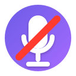

# Mute Meet



Toggle mute/unmute in Google Meet using a global shortcut on macOS.

## Installation

### Extension

1. Open `chrome://extensions/`.
2. Enable Developer mode.
3. Click "Load unpacked" and select this folder.

Notes:
- The extension targets the most recently used `meet.google.com` tab.
- It listens to a tiny local relay via WebSocket, triggered by a POST request.

### Server

In a new terminal:
```bash
./scripts/install.sh
```

Or, to run from source:
```bash
npm install
npm start
```

This starts HTTP on `http://127.0.0.1:9876` and WS on `ws://127.0.0.1:9876`.

## Usage

The extension auto-connects to the relay.

1. To toggle from anywhere:
   ```bash
   curl -X POST http://127.0.0.1:9876/toggle
   ```

2. Bind a global hotkey:

   a. Use Shortcuts:
      - Create a Shortcut "Toggle Meet Mute" with action "Get Contents of URL" → Method: POST → URL: `http://127.0.0.1:9876/toggle` → no body.
      - Assign a keyboard shortcut in System Settings → Keyboard → Keyboard Shortcuts → Shortcuts.

   b. Using Karabiner-Elements:
      - Alternatively, add a Karabiner-Elements configuration file to map function keys such as F5 (Microphone):
      ```json
      {
         "description": "Maps F5 to Mute",
         "manipulators": [{
            "from": { "key_code": "f5" },
            "to": [{ "shell_command": "curl -X POST http://127.0.0.1:9876/toggle" }],
            "type": "basic"
         }]
      }
      ```

3. Watch logs:
   ```bash
   tail -f ~/Library/Logs/com.mute-meet.relay/out.log
   tail -f ~/Library/Logs/com.mute-meet.relay/err.log
   ```

## Uninstallation

To uninstall Mute Meet:
```bash
./scripts/uninstall.sh
```

Don't forget to remove the keyboard mapping or shortcuts.
